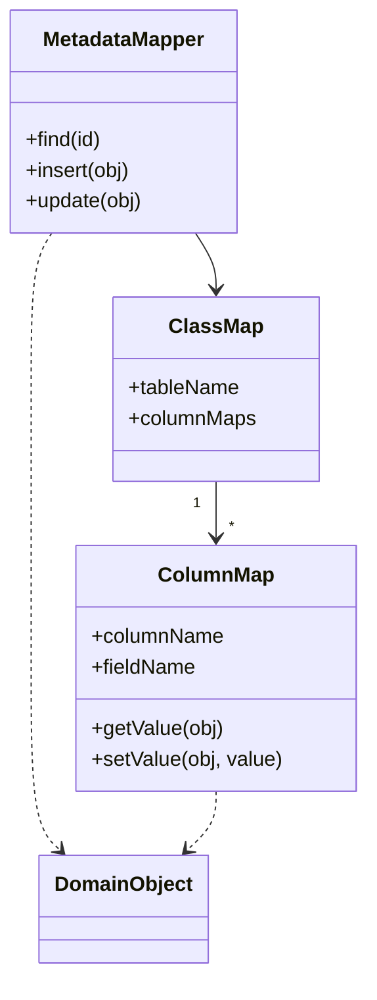

```mermaid
classDiagram
    class MetadataMapper {
        +find(id)
        +insert(obj)
        +update(obj)
    }
    class ClassMap {
        +tableName
        +columnMaps
    }
    class ColumnMap {
        +columnName
        +fieldName
        +getValue(obj)
        +setValue(obj, value)
    }
    class DomainObject
    MetadataMapper --> ClassMap
    ClassMap "1" --> "*" ColumnMap
    MetadataMapper ..> DomainObject
    ColumnMap ..> DomainObject
```
