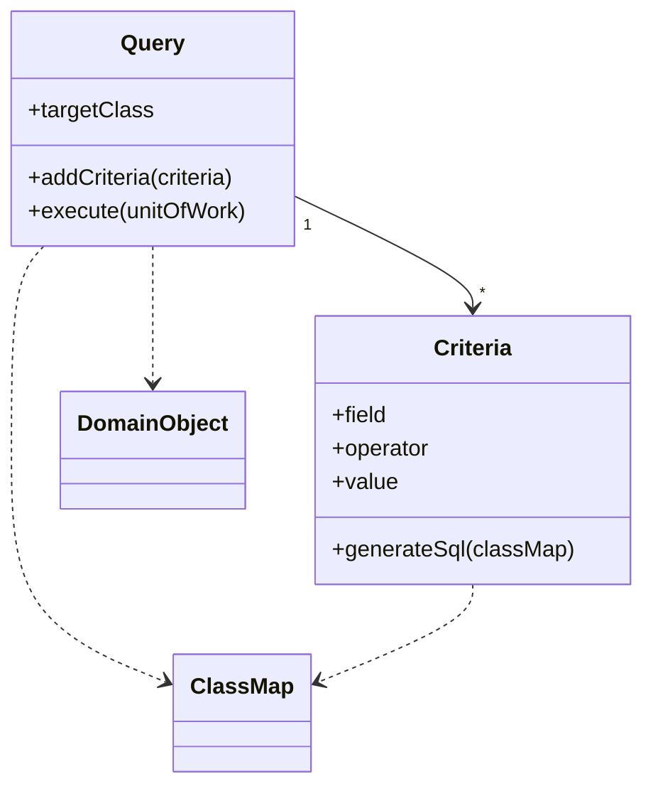

```mermaid
classDiagram
    class Query {
        +targetClass
        +addCriteria(criteria)
        +execute(unitOfWork)
    }
    class Criteria {
        +field
        +operator
        +value
        +generateSql(classMap)
    }
    class ClassMap
    class DomainObject
    Query "1" --> "*" Criteria
    Query ..> ClassMap
    Criteria ..> ClassMap
    Query ..> DomainObject
```
