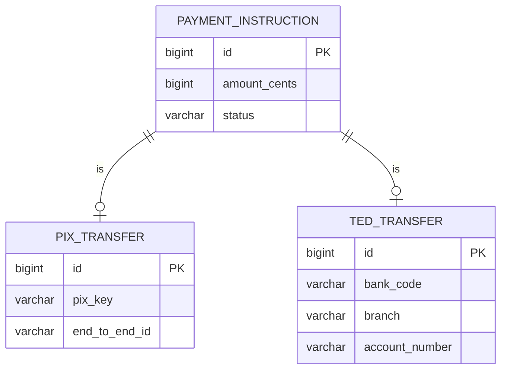

```mermaid
erDiagram
    PAYMENT_INSTRUCTION ||--o| PIX_TRANSFER : is
    PAYMENT_INSTRUCTION ||--o| TED_TRANSFER : is
    PAYMENT_INSTRUCTION {
        bigint id PK
        bigint amount_cents
        varchar status
    }
    PIX_TRANSFER {
        bigint id PK
        varchar pix_key
        varchar end_to_end_id
    }
    TED_TRANSFER {
        bigint id PK
        varchar bank_code
        varchar branch
        varchar account_number
    }
```
