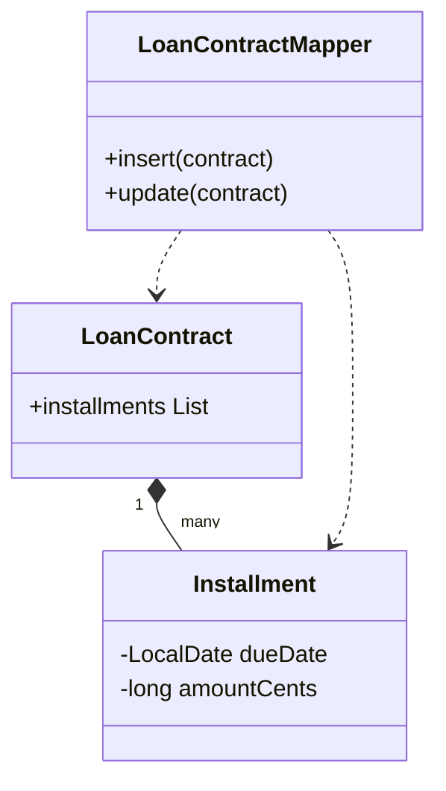

```mermaid
classDiagram
    class LoanContract {
        +installments List
    }
    class Installment {
        -LocalDate dueDate
        -long amountCents
    }
    class LoanContractMapper {
        +insert(contract)
        +update(contract)
    }
    LoanContract "1" *-- "many" Installment
    LoanContractMapper ..> LoanContract
    LoanContractMapper ..> Installment
```
