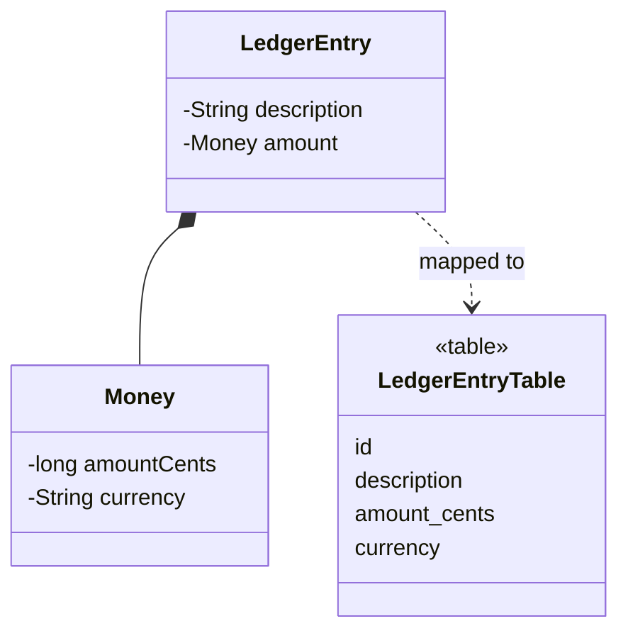

```mermaid
classDiagram
    class LedgerEntry {
        -String description
        -Money amount
    }
    class Money {
        -long amountCents
        -String currency
    }
    class LedgerEntryTable {
        <<table>>
        id
        description
        amount_cents
        currency
    }
    LedgerEntry *-- Money
    LedgerEntry ..> LedgerEntryTable : mapped to
```
