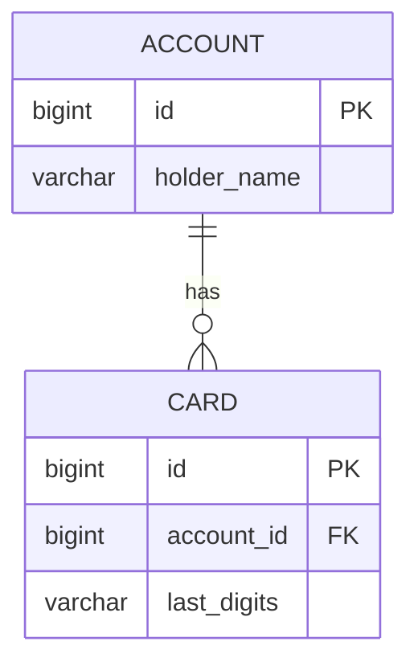

```mermaid
erDiagram
    ACCOUNT ||--o{ CARD : has
    ACCOUNT {
        bigint id PK
        varchar holder_name
    }
    CARD {
        bigint id PK
        bigint account_id FK
        varchar last_digits
    }
```
