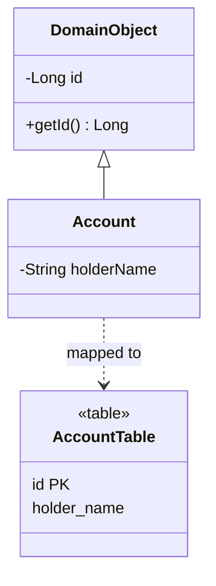

```mermaid
classDiagram
    class DomainObject {
        -Long id
        +getId() Long
    }
    class Account {
        -String holderName
    }
    class AccountTable {
        <<table>>
        id PK
        holder_name
    }
    DomainObject <|-- Account
    Account ..> AccountTable : mapped to
```
