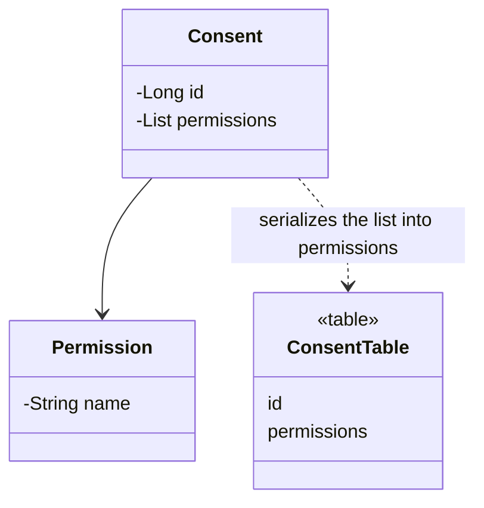

```mermaid
classDiagram
    class Consent {
        -Long id
        -List permissions
    }
    class Permission {
        -String name
    }
    class ConsentTable {
        <<table>>
        id
        permissions
    }
    Consent --> Permission
    Consent ..> ConsentTable : serializes the list into permissions
```
