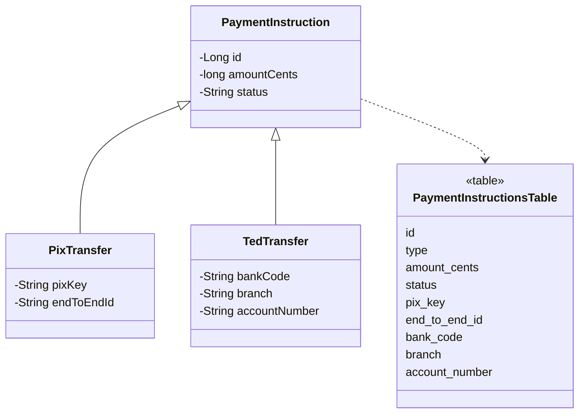

```mermaid
classDiagram
    class PaymentInstruction {
        -Long id
        -long amountCents
        -String status
    }
    class PixTransfer {
        -String pixKey
        -String endToEndId
    }
    class TedTransfer {
        -String bankCode
        -String branch
        -String accountNumber
    }
    class PaymentInstructionsTable {
        <<table>>
        id
        type
        amount_cents
        status
        pix_key
        end_to_end_id
        bank_code
        branch
        account_number
    }
    PaymentInstruction <|-- PixTransfer
    PaymentInstruction <|-- TedTransfer
    PaymentInstruction ..> PaymentInstructionsTable
```
