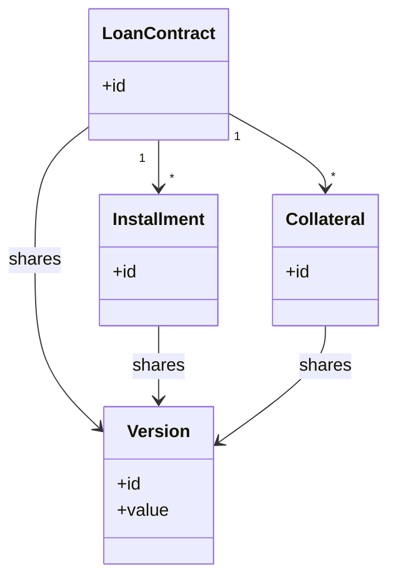

```mermaid
classDiagram
    class Version {
        +id
        +value
    }
    class LoanContract {
        +id
    }
    class Installment {
        +id
    }
    class Collateral {
        +id
    }
    LoanContract --> Version : shares
    Installment --> Version : shares
    Collateral --> Version : shares
    LoanContract "1" --> "*" Installment
    LoanContract "1" --> "*" Collateral
```
