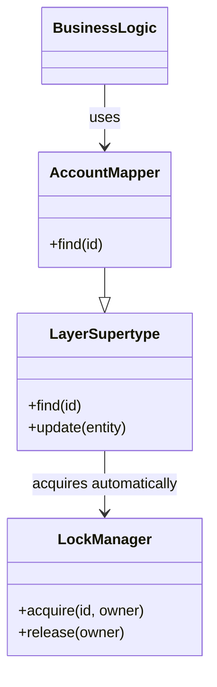

```mermaid
classDiagram
    class BusinessLogic
    class LayerSupertype {
        +find(id)
        +update(entity)
    }
    class LockManager {
        +acquire(id, owner)
        +release(owner)
    }
    class AccountMapper {
        +find(id)
    }
    BusinessLogic --> AccountMapper : uses
    AccountMapper --|> LayerSupertype
    LayerSupertype --> LockManager : acquires automatically
```
