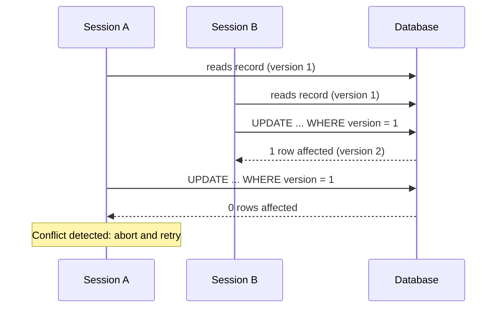

```mermaid
sequenceDiagram
    participant A as Session A
    participant B as Session B
    participant DB as Database
    A->>DB: reads record (version 1)
    B->>DB: reads record (version 1)
    B->>DB: UPDATE ... WHERE version = 1
    DB-->>B: 1 row affected (version 2)
    A->>DB: UPDATE ... WHERE version = 1
    DB-->>A: 0 rows affected
    Note over A: Conflict detected: abort and retry
```
