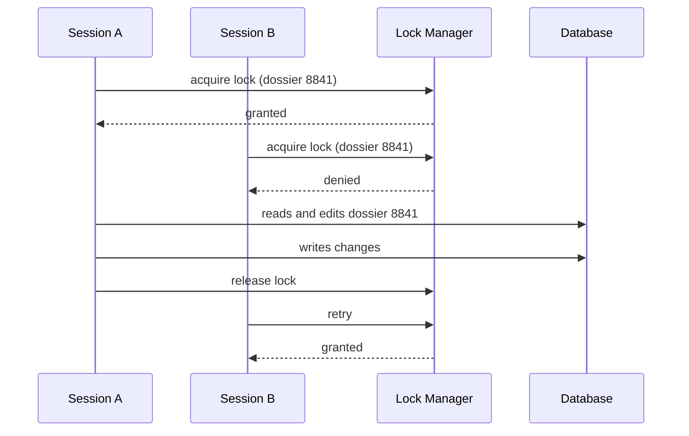

```mermaid
sequenceDiagram
    participant A as Session A
    participant B as Session B
    participant LM as Lock Manager
    participant DB as Database
    A->>LM: acquire lock (dossier 8841)
    LM-->>A: granted
    B->>LM: acquire lock (dossier 8841)
    LM-->>B: denied
    A->>DB: reads and edits dossier 8841
    A->>DB: writes changes
    A->>LM: release lock
    B->>LM: retry
    LM-->>B: granted
```
