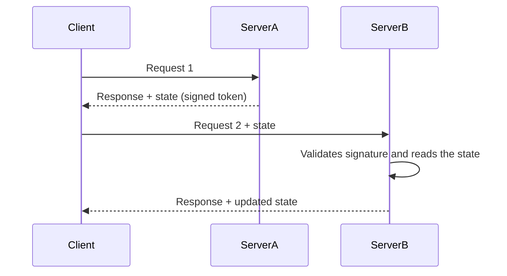

```mermaid
sequenceDiagram
    participant Client
    participant ServerA
    participant ServerB
    Client->>ServerA: Request 1
    ServerA-->>Client: Response + state (signed token)
    Client->>ServerB: Request 2 + state
    ServerB->>ServerB: Validates signature and reads the state
    ServerB-->>Client: Response + updated state
```
