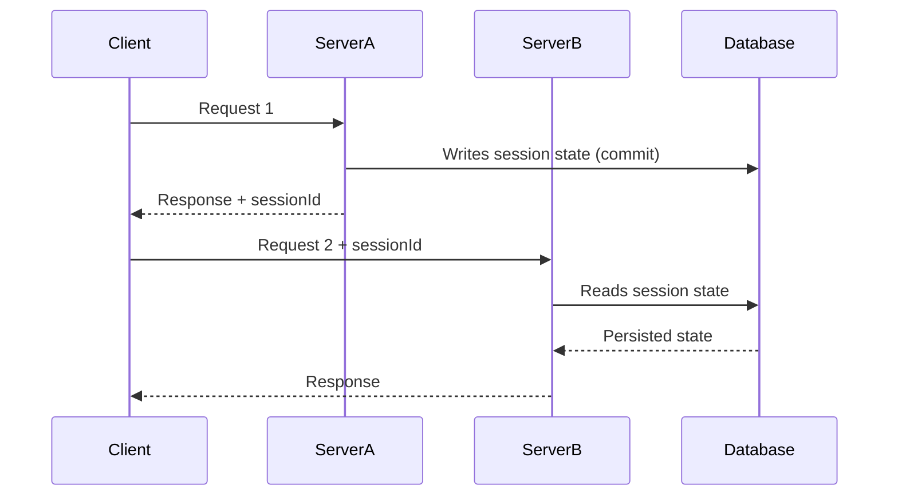

```mermaid
sequenceDiagram
    participant Client
    participant ServerA
    participant ServerB
    participant Database
    Client->>ServerA: Request 1
    ServerA->>Database: Writes session state (commit)
    ServerA-->>Client: Response + sessionId
    Client->>ServerB: Request 2 + sessionId
    ServerB->>Database: Reads session state
    Database-->>ServerB: Persisted state
    ServerB-->>Client: Response
```
