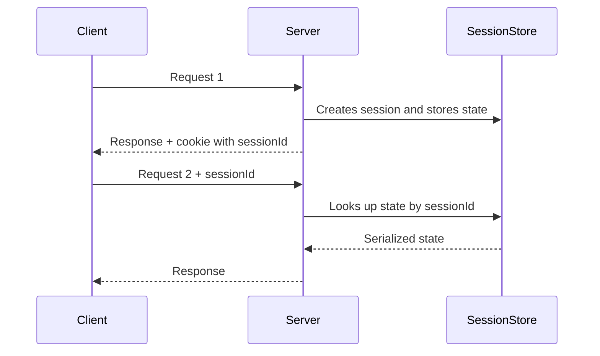

```mermaid
sequenceDiagram
    participant Client
    participant Server
    participant SessionStore
    Client->>Server: Request 1
    Server->>SessionStore: Creates session and stores state
    Server-->>Client: Response + cookie with sessionId
    Client->>Server: Request 2 + sessionId
    Server->>SessionStore: Looks up state by sessionId
    SessionStore-->>Server: Serialized state
    Server-->>Client: Response
```
