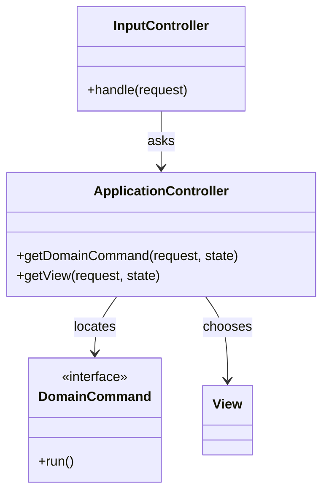

```mermaid
classDiagram
    class InputController {
        +handle(request)
    }
    class ApplicationController {
        +getDomainCommand(request, state)
        +getView(request, state)
    }
    class DomainCommand {
        <<interface>>
        +run()
    }
    class View
    InputController --> ApplicationController : asks
    ApplicationController --> DomainCommand : locates
    ApplicationController --> View : chooses
```
