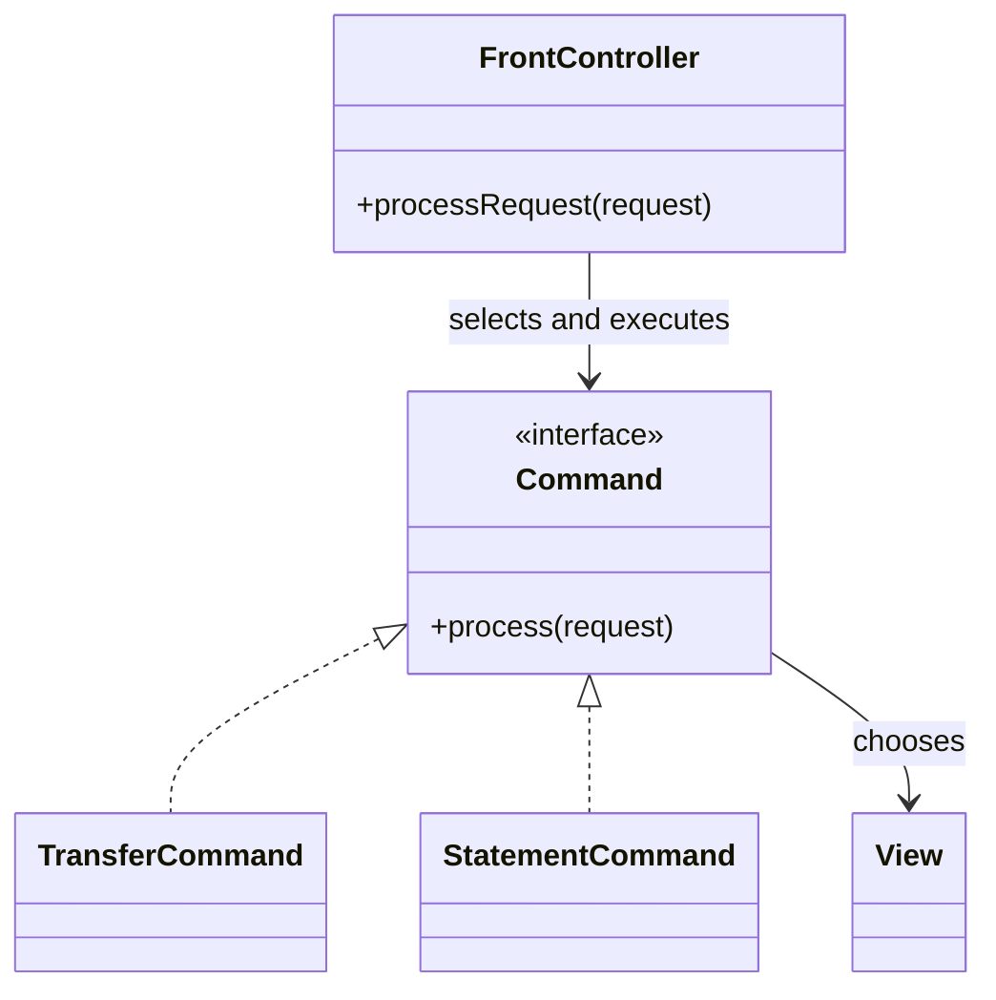

```mermaid
classDiagram
    class FrontController {
        +processRequest(request)
    }
    class Command {
        <<interface>>
        +process(request)
    }
    class TransferCommand
    class StatementCommand
    class View
    FrontController --> Command : selects and executes
    Command <|.. TransferCommand
    Command <|.. StatementCommand
    Command --> View : chooses
```
