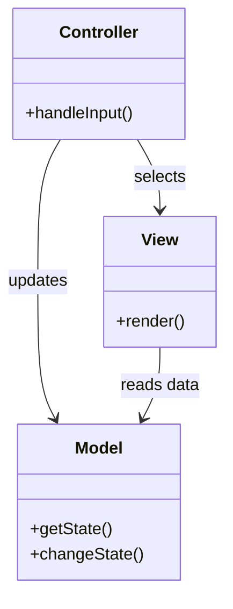

```mermaid
classDiagram
    class Controller {
        +handleInput()
    }
    class View {
        +render()
    }
    class Model {
        +getState()
        +changeState()
    }
    Controller --> Model : updates
    Controller --> View : selects
    View --> Model : reads data
```
