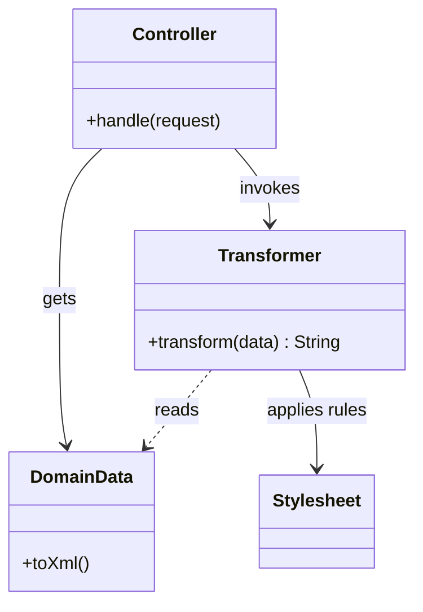

```mermaid
classDiagram
    class Controller {
        +handle(request)
    }
    class DomainData {
        +toXml()
    }
    class Transformer {
        +transform(data) String
    }
    class Stylesheet
    Controller --> DomainData : gets
    Controller --> Transformer : invokes
    Transformer --> Stylesheet : applies rules
    Transformer ..> DomainData : reads
```
